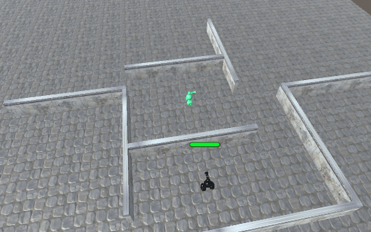

# AI-RobotGuard-BTS

Modifica el proyecto de RobotGuard para hacer el que el NPC vuelva a la última posición donde vio al jugador antes de huir. Debe volver después de que su salud se haya recuperado por encima de 40.

---

Creación de un nuevo árbol "ReturnToPlayerLastSeenPosition", así como funciones como "RegisterPlayerLastSeenPosition" y métodos de control como "SetFleeStatus" y "HasFledFromThePlayer".

